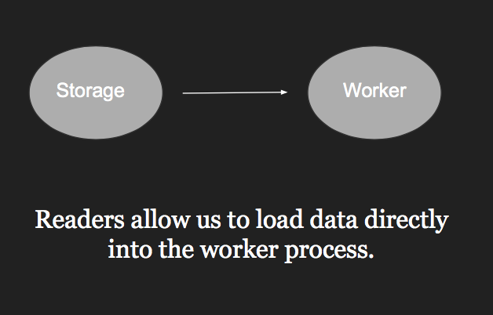

# Lecture 1 Welcome to TensorFlow
## Why TensorFlow?
- **Portability**: deploy computation to one or more CPUs ot GOUs in a desktop, server, or mobile device with a single API
- **Flexibility**: from Raspberry Pi, Android, Windows, iOS, Linux to server farms
- **Visualization**: TensorBoard
- **Checkpoints**: Managing experiments
- **Auto-differentiation**: autdiff

## import tensorflow as tf

1. **TF Learn**(tf.contrib.learn): simplified interface that helps users transition from the world of one-liner such as scikit-learn
2. **TF Slim**(tf.contrib.slim): lightweight library for defining, training and evaluating complex models in TensorFlow
3. High level API: Keras, TFLearn, Pretty Tensor

## Data Flow Graphs

*TensorFlow separates definition of computations from their execution*

**Phase 1**: assemble a graph
**Phase 2**: use a session to execute operations in the graph

## What's tensor

**An n-dimensional matrix**
0-d tensor: scalar(number)
1-d tensor: vector
2-d tensor: matrix
and so on

## How to get the value of node
- Create a session, assign it to variable sess so we can call it later
- Within the session, evaluate the graph to fetch the value of node

**tf.Session()**: A *Session* object encapsulates the environment in which *Operation* objects are executed, and *Tensor* objects are evaluated 

**More (sub)graphs**: Possible to break graphs into several chunks and run them parallelly across multiple CPUs, GPUs, or devices

**tf.device()**: to put part of a graph on a specific CPU or GPU

**tf.Graph()**: to add operators to a graph, set it as default

'''python

g = tf.Graph()
with g.as_default():
	x = tf.add(3,5)

sess = tf.Session(graph=g)
with tf.Session as sess:
	sess.run(x)
	
'''

## Why graphs
1. Save computation(only run subgraphs that lead to the values you want to fetch)
2. Break computation into small, differential pieces to facilitates auto-differentiation
3. Facilitate distributed computation, spread the work across multiple CPUs, GPUs, or devices
4. Many common machine learning models are commonly taught and visualized as directed graphs already
---
# Lecture 2 TensorFlow Ops

## Agenda
- Basic operation
- Tensor types
- Placeholders and feeding inputs
- Lazy loading

## TensorBoard
### Codes
writer = tf.summary.FileWriter("./graphs", sess.graph)

with tf.Session() as sess:
### Run it
$ python [program].py

$ tensorboard --logdir="./graphs" --port 6006

### Open browser and go to: http://localhost:6006/

## tf.constant
tf.constant(value, dtype=None, shape=None, name='Const', verify_shape=False)

tf.zeros(shape, dtype=tf.float32, name=None)
*creates a tensor of shape and all elements will be zeros(when ran in session)*

tf.zeros_like(input_tensor, dtype=None, name=None, optimize=True)
*creates a tensor of shape and type(unless type is specified) as the input_tensor but all elements are zeros*

tf.ones(shape, dtype=tf.float32, name=None)
tf.ones_like(input_tensor, dtype=None, name=None, optimize=True)

tf.fill(dims, value, name=None)
*creats a tensor filled with a scalar value*

### Constant as sequences
tf.linspace(start, stop, num, name=None)
tf.range(start, limit=None, delta=1, dtype=None, name='range')
**Tensor objects are not iterable**

### Randomly Generated Constants
tf.random_normal(shape, mean=0.0, stddev=1.0, dtype=tf.float32, seed=None, name=None)

tf.truncated_normal(shape, mean=0.0, stddev=1.0, dtype=tf.float32, seed=None, name=None)

tf.random_uniform(shape, minval=0, maxval=None, dtype=tf.float32, seed=None, name=None)

tf.random_shuffle(value, seed=None, name=None)

tf.random_crop(value, size, seed=None, name=None)

tf.multinomial(logits, num_samples, seed=None, name=None)

tf.random_gamma(shape, alpha, beta=None, dtype=tf.float32, seed=None, name=None)

**tf.set_random_seed(seed)**

## Operations

tf.add()

tf.add_n()

tf.mul()

tf.matmul()

tf.div()

tf.mod()

##TensorFlow Data Types

- **TensorFlow integrates seamlessly with NumPy**
- **Can pass numpy types to TensorFlow ops**
- **For tf.Session.run(fetches)**: if the requested fetch is a Tensor, then the output of will be a NumPy ndarray
- **Do not use Python native types for tensors because TensorFlow has to infer Python type**
- **Beware when using NumPy arrays because NumPy and TensorFlow might become not so compatible in the future**
- **Do not use constants, constants are stored in the graph definition**:
***This makes loading graphs expensive when constants are big, only use constants for primitive types. Use variables or readers for more data that requires more memory.***

## Variables
**tf.Variables()**

- The easiest way is initializing all variables at once:

>init = tf.global_variables_initializer()
>
>with tf.Session() as sess:
>
>sess.run(init)

- Initialize only a subset of variables:

>init_ab = tf.variable_initializer([a, b], name="init_ab")
>
>with tf.Session as sess:
>
>sess.run(init_ab)

- Initialize a single variable

>W = tf.Variable(tf.zeros[784, 10])
>
>with tf.Session as sess:
>
>sess.run(W.initializer)

#### Eval()
>W = tf.Variable(tf.truncated_normal([700, 10]))
>
>with tf.Session() as sess:
>
>sess.run(W.initializer)
>
>print(W.eval())

#### tf.Variable.assign()
>W = tf.Variable(10)
>
>W.assign(100)
>
>with tf.Session() as sess:
>
>sess.run(W.initializer)
>
>print(W.eval()) # >> 10 (W.assign(100) doesn't assign the value 100 to W. It creates an assign op, and that op needs to be run to take effect)

---

>W = tf.Variable(10)
>
>W.assign(100)
>
>with tf.Session() as sess:
>
>sess.run(assign_op)
>
>print(W.eval()) # >> 100 (You don't need to initialize variable because assign_op does it for you)

## Session VS InteractiveSession
*You sometimes see InteractiveSession instead of Session. The only difference is an InteractiveSession makes itself the default*

## Control Dependencies

**tf.Graph.control_dependencies(control_input)**: define which ops should be run first

## Placehoders

A TF program often has 2 phase:
1. Assemble a graph
2. Use a session to execute operations in the graph

*why placeholders*
We can later supply their own data when they need to execute the computation

*tf.placeholder(dtype, shape=None, name=None)*

### Feed the values to placeholders using a dictionary

### Placeholders are valid ops

### You can feed_dict any feedable tensor. Placeholder is just a way to indicate that something must be fed

### tf.Graph.is_feedable(tensor)

True if and only if tensor is feedable

## Lazy Loading

***Defer creating/initiablizing an object until it is needed***

### Graph description
**tf.get_default_graph().as_graph_def()**
---
# Lecture 3 Basic Models in TensorFlow

## Agenda
- Review
- Linear regression in TensorFlow
- Optimizers
- Logistic regression on MNIST
- Loss function

## Linear Regression

- Phase 1: Assemble our graph
	- Step 1: Read in data
	- Step 2: Create placeholders for input and labels (X,Y)
	- Step 3: Create weight and bias (w, b)
	- Step 4: Build model to predict Y
	- Step 5: Specify loss function
	- Step 6: Create optimizer
- Phase 2: Train our model
	- Initialize variables
	- Run optimizer op(with data fed into placeholders for inputs and labels)
- See model in TensorBoard
	- Step 1: writer = tf.summary.FileWriter('./graph', sess.graph)
	- Step 2: $ tensorboard --logdir='./graph'

## Optimizer

*Session looks at all **trainable** variables that optimizer depends on and update them*

### List of optimizers in TF

- tf.train.GradientDescentOptimizers
- tf.train.AdagradOptimizer
- tf.train.MomentumOptimizer
- tf.train.AdamOptimizer
- tf.train.ProximalGradientDescentOptimizer
- tf.train.ProximalAdagradOptimizer
- tf.train.RMSPropOptimizer
- And more

## Huber loss

Robust to outliers

Intuition: if the difference between the predicted value and the real value is small, square it

If it's large, take its absolute value
---
# Lecture 4 Structure your model

## Agenda
- Overall structure of a model in TensorFlow
- word2vec
- Name scope
- Embedding visualization

### Phrase 1: Assemble graph
1. Define placeholders for input and output
2. Define the weights
3. Define the inference model
4. Define loss function
5. Define optimizer

### Phrase 2: Compute

## Word Embedding
*Capture the semantic relationships between words*

### Embedding Lookup
tf.nn.embedding_lookup(params, ids, partition_strategy='mod', name=None, validate_indices=True, max_norm=None)

### NCE Loss
tf.nn.nce_loss(weights, biases, labels, inputs, num_sampled, num_classes, ...)

## Name scope
*Group nodes together*

with tf.name_scope(name)
---
# Lecture 5 Manage Experiments

## Agenda
- More word2vec
- tf.train.Saver
- tf.summary
- Randomization
- Data Readers

**tf.gradients(y, [xs])**:
Take derivative of y with respect to each tensor in the list [xs]

## Manage experiments

###**tf.train.Saver**:
saves graph's variables in binary files

#### Saves sessions, not graphs
tf.train.Saver.save(sess, save_path, global_step=None, ...)
**Only save variables, not graph**
**Checkpoints map variable names to tensors**

#### Save parameters after 1000 steps

>_#define model
>
>_#create a saver object
>
>saver = tf.train.Saver()
>
>_#launch a session to compute the graph
>
>with tf.Session as sess
>
>_#actual training loop:
>
>for step in range(training_steps):
>
>sess.run([optimizer])
>
>if (step+1) % 1000==0:
>
>saver.save(sess, 'checkpoints_directory/model_name', global_step=model.global_step)

#### Each saved step is a checkpoint
**Global step**
*Common in TensorFlow*
self.global_step = tf.Variable(0, dtype=tf.int32, trainable=False, name='global_step')
*Need to tell optimizer to increment global step*
self.optimizer = tf.train.GradientDescentOptimizer(self.lr).minimize(self.loss, global_step=self.global_step)

#### Restore variables
saver.restore(sess, 'checkpoints/name_of_the_checkpoints')

e.g. saver.restore(sess, 'checkpoints/skip-gram-99999')

#### Restore the latest checkpoint

ckpt = tf.train.get_checkpoint_state(os.path.dirname('checkpoints/checkpoint'))

if ckpt and ckpt.model_checkpoint_path:
	saver.restore(sess, ckpt.model_checkpoint_path)
	
- *checkpoint keeps track of the latest checkpoint*
- *Safeguard to restore checkpoints only when there are checkpoints*

### **tf.summary**

*Visualize our summary statistics during our training*

- tf.summary.scalar
- tf.summary.histogram
- tf.summary.image

#### Step 1: create summaries

>with tf.name_scope("summaries"):
>	
>__	tf.summary.scalar("loss", self.loss)
>
>__tf.summary.scalar("accuracy", self.accuracy)
>
>__tf.summary.histogram("histogram loss", self.loss)
>
>_# merge them all
>
>__self.summary_op = tf.summary.merge_all()

#### Step 2: rum them

>loss_batch, _, summary = sess.run([model.loss, model.optimizer, model.summary_op], feed_dict=feed_dict)

*Like everything else in TF, summaries are ops*

#### Step 3: write summaries to file

>writer.add_summary(summary, global_step=step)

### Control Randomization

#### Op level random seed
>my_var = tf.Variable(tf.truncated_normal((-1.0, 1.0),stddev=0.1, seed=0))

#### Sessions keep track of random state
#### Graph level seed
>tf.set_random_seed(seed)

## Data Readers
### Problem with feed_dict
- Slow when client and workers are on different machines
- Readers allow us to load data directly into the worker process

### Different Readers for different file types

**tf.TextLineReader**: Outputs the lines of a file delimited by newlines(text files, CSV files)

**tf.FixedLengthRecordReader**: Outputs the entire file when all files have same fixed lengths(each MNIST has 28 * 28 pixels, CIFAR-10 32 * 32 * 3)

**tf.WholeFileReader**:
Outputs the entire file content

**tf.TFRecordReader**:
Reads samples from TensorFlow's own binary format(TFRecord)

**tf.ReaderBase**:
To allow you to create your own readers

### Read in files from queues
>filename_queue = tf.train.string_input_producer(["file0.csv", "file1.csv"])
>
>reader = tf.TextLineReader()
>
>key, value = reader.read(filename_queue)

### Threads & Queues
**You can use tf.Coordinator and tf.QueueRunner to manage your queues**

>with tf.Session() as sess:
>
>__#start populating the filename queue
>
>__coord = tf.train.Coordinator()
>
>__threads = tf.train.start_queue_runner(coord=coord)
---
# Lecture 6 Convolutional Neural Networks + Neural Style Transfer

## Outline
- Convolutional Neural Networks
	- Convolution
	- Pooling
	- Feature Visualization
- Neural Style Transfer
	- Feature Inversion
	- Texture Synthesis
	- Style Transfer

## Convolutional Neural Networks: Deep Learning with Images

- Object Detection = What and Where
- Object segmentation
- Pose Estimation
- Image Captioning
- Dense Image Captioning
- Visual Question Answering
- Image Super-Resolution  
- Generating Art

## What is a Convolutional Neural Net
- Fully-Connected Neural Network
- Convolutional Neural Network
	- Convolution layer
	- Pooling layer
		- makes the representations smaller and more manageable
		- operates over each activation map independently

### Case Study
- LeNet-5
- AlexNet
- VGGNet
- GoogLeNet
- ResNet

## Visualizing ConvNet Features
1. Feed image into net
2. Set gradient of chosen layer to all zero, except 1 for the chosen neuron
3. Backprop to image

### Gradient Ascent

## Feature Inversion
Given a feature vector for an image, find a new image such that:
- Its features are similar to the given features
- It "looks natural"(image prior regularization)

## (Neural) Texture Synthesis
Given a sample patch of some texture, can we generate a bigger image of the same texture?

### Neural Texture Synthesis
1. Pretrain a CNN on ImageNet(VGG-19)
2. Run input texture forward through CNN, record activations on every layer; layer i gives feature map of shape C * H * W
3. At each layer compute the Gram matrix giving outer product of features
4. Initialize generated image from random noise
5. Pass generated image through CNN, compute Gram matrix on each layer
6. Compute loss: weighted sum of L2 distance between Gram matrix
7. Backprop to get gradient on image
8. Make gradient step on image
9. GOTO 5 	

## Style Transfer: Feature Inversion + Texture Synthesis

### Neural Style Transfer: Feature + Gram Reconstruction

### Neural Style Transfer
Given a **content image** and a **style image**, find a new image that:
- Matches the CNN features of the content image(feature reconstruction)
- Matched the Gram matrices of the style image(texture synthesis)

# Lecture 7 Convnets in TensorFlow

## Agenda
- Playing with convolutions
- Convolution support in TF
- More MNIST
- Autoencoder

## Understanding convolutions
- Convolutions in maths and physics
- Convolutions in neural networks:
	- a function derived from two given functions by *element-wise* *multiplication* that expresses how the *value and shape* of one is modified by the other
	- we can use one single convolutional layer to modify a certain image
	
	- **tf.nn.conv2d(input, filter, strides, padding, use_cudnn_on_gpu=None, data_format=None, name=None)**

- Convolutions without training
	- blur
	- sharpen
	- edge
	- top sobel
	- emboss
- Convolutions in neural networks:
	- In traning, we don't specify kernels. We learn kernels.
- **Getting dimensions right**
	- **tf.nn.conv2d(input, filter, strides, padding, use_cudnn_on_gpu=None, data_format=None, name=None)**
	- **Input**: Batch size * Height * Width * Channels
	- **Filter**: Height * Width * Input Channels * Output Channels
	- **Strides**: 4 element 1-D tensor, strides in each direction
	- **Padding**: 'SAME' or 'VALID'
	- **Data_format**: default to NHWC(Num_samples x Height x Width x Channels)  	

## Convnet with MNIST
### TensorFlow Support
- Convolution: ***tf.nn.conv2d***
- Relu: ***tf.nn.relu***
- Maxpool: ***tf.nn.max_pool***
- Fully connected: ***tf.nn.dense***
- Softmax: ***tf.nn.softmax_cross_entropy_with_logits***

### Variable scope
>with tf.variable_scope('conv1') as scope:
>
>__w = tf.get_variable('weights', [5,5,1,32])
>
>__b = tf.get_variable('biases', [32], initializer=tf.random_normal_initializer())
>
>__conv = tf.nn.conv2d(images, w, strides=[1,1,1,1], padding='SAME')
>
>__conv1 = tf.nn.relu(conv + b, name=scope.name)

## Autoencoder

- Input and Output dimensions should match
- Input and Output range should be same

---

# Lecture 8 Guest Lecture([Jon Shlens](https://research.google.com/pubs/JonathonShlens.html))

# Lecture 9 TensorFlow Input Pipeline

## Agenda
- **Data Records Revisited**
- **TFRecord**
- **Variable Initializer**
- **Graph Collection**
- **Style Transfer**

## Queues
- **tf.Session** objects are designed to multithreaded(can run ops in parallel)
- Important TensorFlow objects for computing tensors **asychronously** in a graph
	- Multiple threads prepare training examples and push them in the queue
	- A traning thread executes a training op that dequeues mini-batches from the queue
	- All threads must be able to stop together
	- Exceptions must be caught and reported
	- Queues must be properly closed when stopping
- TensorFlow queues can't run without proper threading, but threading isn't exactly pleasant in Python  
- **tf.Coordinator** and **tf.train.QueueRunner**
	- **QueueRunner**: create a number of threads cooperating to enqueue tensors in the same queue
	-  **Coordinator**: help multiple threads stop together and report exceptions to a program that waits for them to stop

|Queue|What's it?|Ops supported|
|-----|----------|-------------|
|**tf.FIFOQueue**|Dequeues elements in first in first out orders|enqueue \enqueue_many \dequeue|
|**tf.RandomShuffleQueue**|Dequeues elements in a random order|enqueue \enqueue_many \dequeue|
|**tf.PaddingFIFOQueue**|FIFOQuue with padding to supports batching variable_size tensors|enqueue \enqueue_many \dequeue \dequeue_many|
|**tf.PriorityQueue**|FIFOQueue whose enqueue and queue have another argument: priority|enqueue \enqueue_many \dequeue|

***Create a queue***
tf.FIFOQueue(capacity, min_after_dequeue, dtypes, shapes=None, name=None...)

Same for other queue

### Queue example
>_#dummy data
>
>//In practice, you can use any op to read in your data
>
>all_data = 10 * np.random.randn(N_SAMPLE, 4) + 1
>
>all_target = np.random.randint(0, 2, size=N_SAMPLES)
>
>_#create queue
>
>_#dtypes specifies types of data and label
>
>_#shapes specifies shape of data and label
>
>queue = tf.FIFOQueue(capacity=50, dtype=[tf.float32, tf.int32], shapes=[[4], []])
>
>_#a common practice is to enqueue all data at once, but dequeue one by one
>
>enqueue_op = queue.enqueue_many([all_data, all_target])
>
>data_sample, label_sample = queue.dequeue()
>
>qr = tf.train.QueueRunner(queue, [enqueue_op] * NUM_THREADS)
>
>with tf.Session() as sess:
>
>_#create a coordinator, launch the queue runner threads
>
>__coord = tf.train.Coordinator()
>
>__enqueue_threads = qr.create_threads(sess, coord=coord, start=True)
>
>__for step in xrange(100): #do to 100 iteration
>
>____if coord.should_stop():
>
>______break
>
>____one_data, one_label = sess.run([data_sample, label_sample])
>
>__coord.request_stop()
>
>__coord.join(enqueue_threads)
>

### Dequeue multiple elements
**tf.train.batch** or **tf.train.shuffle_batch** if you want to your batch to be shuffled

### tf.Coordinator
**tf.Coordinator**: can be used to manage the threads you created without queues

>import threading
>
>_#thread body: loop until the coordinator indicates a stop was requested.
>
>_#if some condition becomes true, ask the coordinator to stop
>
>def my_loop(coord):
>
>__while not coord.should_stop():
>
>____...do something...
>
>__if ...some condition ...:
>
>____coord.request_stop()
>
>_# main code: create a coordinator
>
>coord = tf.Coordinator()
>
>_#create 10 threads that run 'my_loop()'
>
>_#you can also create threads using QueueRunner as example above
>
>threads = [threading.Thread(target=my_loop, args=(coord,)) for _ in xrange(10)]
>
>_#start the threads and wait for all of them to stop
>
>for t in threads: t.start()
>
>coord.join(threads)

## Data Readers

### Three ways to read in data
1. Through tf.constant(make everything a constant)
2. Feed dict: slow when client and workers are on different machines

3. Data readers

### Different Readers for different file types
- **tf.TextLineReader**: Outputs the lines of a file delimited by newlines
- **tf.FixedLengthRecordReader**: Outputs the entire file when all files have same fixed length
- **tf.WholeFileReader**: Outputs the entire file content
- **tf.TFRecordReader**: Read samples from TensorFlow's own binary format(TFRecord)
- **tf.ReaderBase**: To allow you to create your own readers

### Read in files from queues

## TFRecord

TensorFlow's binary file format: a serialized tf.train.Example protobuf object

### Using TFRecord
- Convert normal files to TFRecord
- Read in TFRecord

### why binary
- make better use of disk cache
- faster to move around
- can store data of different types (so you can put both images and labels in one place)

---

# Lecture 11 RNNs in TensorFlow

## Agenda
- All about RNNs
- Implementation tricks & treats
- Live demo of Language Modeling

## RNNs
### From feed-forward to RNNs
- RNNs take advantage of sequential information of data(texts, genomes, spoken words, etc)
- Directed cycles
- All steps share weights to reduce the total number of parameters
- Form the backbone of NLP
- Can also be used for images
### Simple Recurrent Neural Networks(sRNN)
- In practice, RNNs aren't very good at capturing long-term dependencies

### LSTM(Long Short Term Memory)
- Control how much of new input to take, how much of the previous hidden state to forget
- Closer to how humans precess information
- The idea is not new

### LSTMs VS GRUs
- People find LSTMs work well, but unnecessarily complicated, so they introduced GRUs(Gated Recurrent Units)

### GRUs(Gated Recurrent Unites)
- Computationally less expensive
- Performance on pair with LSTMs

### What can RNNs do?
#### Language Modeling
- Allows us to measure how likely a sentence is important input for Machine Translation(since high-probability sentences are typically correct)
- Can generate new text

#### Character-level Language Modeling
#### Machine Translation
#### Text Summarization
#### Image Captioning

## RNNs in TensorFlow

### Cell Support(**tf.nn.rnn_cell**)
- BasicRNNCell: The most basic RNN cell
- RNNCell: Abstract object representing an RNN cell
- BasicLSTMCell: Basic LSTM recurrent network cell
- LSTMCell: LSTM recurrent network cell
- GRUCell: Gated Recurrent Unit cell

### Construct Cells(**tf.nn.rnn_cell**)
cell = tf.nn.rnn_cell.GRUCell(hidden_size)

### Stack multiple cells
cell = tf.nn.rnn_cell.GRUCell(hidden_size)
rnn_cells = tf.nn.rnn_cell.MultiRNNCell([cell] * num_layers)

### Construct Recurrent Neural Network
- **tf.nn.dynamic_rnn**: uses a **tf.While** loop to dynamically construct the graph when it is executed. Graph creation is faster and you can feed batches of variable size.
- **tf.nn.bidirectional_dynamic_rnn**: dynamic_rnn with bidirectional

### Stack multiple cells
cell = tf.nn.rnn_cell.GRUCell(hidden_size)

rnn_cells = tf.nn.rnn_cell.MultiRNNCell([cell] * num_layers)

output, out_state = tf.nn.dynamic_rnn(cell, seq, **length**, initial_state)

**Note**: most sequences are not of the same lenght

### Dealing with variable sequence length
- Pad all sequences with zero vectors and all labels with zero label(to make them of the same length)
- Most current models can't deel with sequences of length layer than 120 tokens, so there is ussually a fixed max_length and we truncate the sequences to that max_length.

#### Problem with Padded/truncated sequence length
- The padded labels change the total loss, which affects the gradient
- **Approach 1**
	- Maintain a mask(True for real False for padded tokens)
	- Run your model on both the real/padded tokens(model will predict labels for the padded tokens as well)
	- Only take into account the loss caused by the real elements
> full_loss = tf.nn.softmax_cross_entropy_with_logits(preds, labels)
>
> loss = tf.reduce_mean(tf.boolean_mask(full_loss, mask)) 

- **Approach 2**
	- Let your model know the real sequence length so it only predict the labels for the real tokens
> cell = tf.nn.rnn_cell.GRUCell(hidden_size)
>
> rnn_cell = tf.nn.rnn_cell.MultiRNNCell([cell] * num_layers)
>
> **tf.reduce_sum(tf.reduce_max(tf.sign(seq), 2), 1)**
> 
> output, out_state = tf.nn.dynamic_rnn(cell, seq, length, initial_state)

## How to deal with common problems whrn training RNNs

### Vanishing Gradients
- Use different activation units
	- tf.nn.relu
	- tf.nn.relu6
	- tf.nn.crelu
	- tf.nn.elu
- In addition to:
	- tf.nn.softplus
	- tf.nn.softsign
	- tf.nn.bias_add
	- tf.sigmoid
	- tf.tanh
### Exploding Gradients
**Clip gradients with tf.clip_by_global_norm**
> gradients = tf.gradients(cost, tf.trainable_variables())
> 
> _# take gradients of cost w.r.t. all trainable variables
> 
> **clipped_gradients, _ = tf.clip_by_global_norm(gradients, ,ax_grad_norm)**
> 
> _#clip the gradients by pre-defined max norm
> 
> optimizer = tf.train.AdamOptimizer(learning_rate)
> 
> train_op = optimizer.apply_gradients(zip(gradients, trainables))
> 
> _#add the clipped gradients to the optimizer  
 
### Anneal the learning rate
**Optimizers accept both scalars and tensors as learning rate**
>learning_rate = tf.train.exponential_decay(init_lr, global_step, decay_steps, decay_rate, staircase=True)
>
>optimizer = tf.train.AdamOptimizer(learning_rate)

### Overfitting
**Use dropout through tf.nn.dropout or DropoutWrapper for cells**
- tf.nn.dropout
> hidden_layer = tf.nn.dropout(hidden_size, keep_prob)
- DropoutWrapper
> cell = tf.nn.rrn_cell.GRUCell(hidden_size)
> 
> cell = tf.nn.rnn_cell.DropoutWrapper(cell, output_keep_prob=keep_prob)

## Language Modeling

### Neural Language Modeling
- Allows us to measure how likely a sentence is 
- Important input for Machine Translation(since high-probability sentences are typically correct)
- Can generate new text

### Language Modeling: Main approaches
- Word-level: n-grams
- Character-level
- Subword-level: somewhere in between the two above

### Language Modeling: N-grams
- The traditional approach up until very recently
- Train a model to predict the next word based on previous n-grams
- Huge vocabulary
- Can't generalize to OOV(out of vocabulary)
- Requires a lot of memory

### Language Modeling: Character-level
- Introduced in the early 2010s
- Both input and output are characters
#### Pros:
- Very small vocabulary
- 
- Doesn't require word embeddings
- Faster to train
#### Cons:
- Low fluency(many words can be gibberish)

### Language Modeling: Hybrid
- World-level by default, switching to character-level for unknown tokens

#### Language Modeling: Subword-Level
- Input and output are subwords
- Keep W most frequent words
- Keep S most frequent syllables
- Split the rest into characters
- Seem to perform bette than both word-level and character-level models

---

# Lecture 12 Convolutional GRU(Lessons Learned Building the Neural GPU)

**Lessons Learned Building the Neural GPU**
**What I learned building NNs to learn algorithm**

## Gradient Descent

**Gradient descent** is the standard way of training neural networks and many other forms of machine learning.

But it is a very basic method that only finds local minima. It is counter-intuitive to apply it to combinatorial problems. But very high-dimensional spaces are often counter-intuitive and proper representations can make gradient descent applicable to combinatorial problem too.

## Computing with Neural Networks

Basic **feed-forward** neural networks operate on fixed-size vectors, so their power to generalize is limited.
- fixed-size input
- fixed-size output
- number of parameters depends on these sizes
- limited computational power

**Recurrent neural networks** lift this major limitation, but their architecture restricts their power in other ways.
- variable-size input
- variable-size output
- number of parameters depends on **memory size**
- computational power limited by this memory size

## Why learn Algorithms?
Algorithms are universal patterns, so if we can learn them, then in principle we can learn everything. If we can't learn basic ones, then we can't hope to build universal machine intelligence.

### Can't recurrent neural networks do it?
- Only if testing length ~ training
- But with higher length we need to increase network capacity(number of parameters)
- Fail to capture algorithmic patterns, even in principle

### The big dream of Universal Learning
- Kolmogoroff complexity
- Solomonoff induction
- Universal AI

### Precious work on neural algorithm learning
- RNN and LSTM-based, generalizes a bit with attention
- Data-structure based(stack RNNs, memory nets)
- Neural Turing Machines

### Problems with Neural Turing Machines
- Look close, your computers does not have a tape
- Very sequential in nature, hard to train on hard problems
- Example problem: **long multiplication**

## Nueral Computation

### Recurrent Computation
**Recurrent Neural Networks** share weights across time steps but use fixed-size memory vectors.

*Time*: O(f(n))

*Space*: O(1)

### Neural Turing Machines
**Neural Turing Machines** works with variable-size memory and so can do general computation, but are sequtial.

*Time*: O(f(n))

*Space*: O(g(n))

## Arbitrary Size Ops

**Neural Computation** requires operators that use a **fixed number of parameters** but operate on **memory of arbitrary size**. There are a few candidates:
1. Attention(Neural Turing Machine)
2. Stack, (De)Queue, Lsits
3. ...other memory structure...
4. Convolutoins

### Attention mechanism
### Why convolutions
They act like a **neural GPU**
- Attention is a softmax, effectively
- Similarly a stack and other **task-specific** memory structures
- Convolutions affect **all memory items in each step**
- Convolutions are already implemented and **optimized**.
- To train well we need to use LSTM-style gates: **CGRN** 

## Neural GPU
**Convolutional Gated Recurrent Networks(CGRNs)** perform many parallel operations in each step, akin to a **neural GPU** and in contrast to the sequential nature of Neural Turing Machines.

The definition of a CGRN is also very **simple and elegant** 

### CGRU definition
### Computational Power:
- Small number of parameters
- Can simulate computation of **cellular automata**
- With memory of size **n** can do **n local operations/step**
- can do **long multiplication in O(n) steps**

## Tricks of the Trade

A number of techniques are needed to make the training of a Neural GPU work well, and some are required for the generalization to work or to be stable.

- **Curriculum leaning**: Start training on small length, increase when learned.
- **Parameter sharing relaxation**: 
	- Allow to do different things in different time-steps first
	- Not needed now with bigger models and orthogonal init
- **Dropout on recurrent connections**
	- Randomly set 10% of state vectors to 0 in each step
	- Interestingly, this is key for good length generalization
- **Noise added to gradients**: Add small gaussion noise to gradients in each training step
- **Gate cutoff(saturation)**: Instead of sigmoid(x) use [1.2sigmoid(x) - 0.1]
- **Tune parameters. Tune, tune, tune**: A lot of GPUs running for a few months; or: better methods.

## How to code this 
A few issues that come up

Illustrate each one with code

- **Is the graph static or dynamic?**
	- Dynamic ops were not exposed in first TF release, **tricky**
	- Static graph requires bucketing and takes long to build
	- **Focus:** why conditionals are tricky: **batches and lambdas**

- **How do we do bucketing?**
	- Sparse or dense buckets? Masks are bug-prone
	- How do we bucket training data? Feed or queues?
	- If queues, how to do curriculum? How to not starve?

- **How do we writer layers?**  
	- Is there a canonical way to define new functions?
	- Frameworks: Keras vs Slim (OO vs functional)
	- Unification in tf.layers: callable objects sace scope
	- **Example: weight-normalization through custom_getter**

- **How do we organize experiments?**
	- Use tf.learn, Estimator, Experiment
	- How to registering models and problems? Save runs?
	- Hyper-parameters manual or tuned with ranges? 